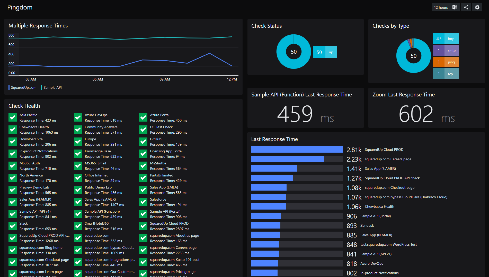

# Pingdom Dashboard
This dashboard gives an overview of Pingdom checks using PowerShell scripts against the Pingdom API

- Check Health - Status block showcasing health and last response time
- Check Status - Donut sumarrizing checks by status
- Checks by Type - Donut summarizing checks by check type
- Last Response Time - Scalar values for single checks - Requires $checkName to be added (can be found in checks detail at bottom of dashboard)
- Last Response Time - Bar of all checks' last response time
- Multiple Reponse Times - Line graph of two checks (easily adapted to include more than two checks) - Requires $checkId1 and $checkId2
- Single Response Time - Line graph for single check - Requires $checkId in script
- Checks Detail - Full check output

Previwe:


## How to use this dashboard
### Setup a PowerShell Profile
- Navigate to System > PowerShell
- Create a new profile called Pingdom containing following (add your own Bearer token without the asterix):

```$url = "https://api.pingdom.com/api/3.1/"

$headers = @{
            authorization = "Bearer ***TOKEN GOES HERE***"
} 
```


### Setup the dashboard
- Copy the JSON from this project
- Create a new dashboard, select the </> on the top right and paste the content of the .json and click **Apply Changes**.
- Tiles that require config contain a sublabel - They simply require a check name or ID to be added into the scripts (all scripts are commented to show you process)
- Publish dashboard
